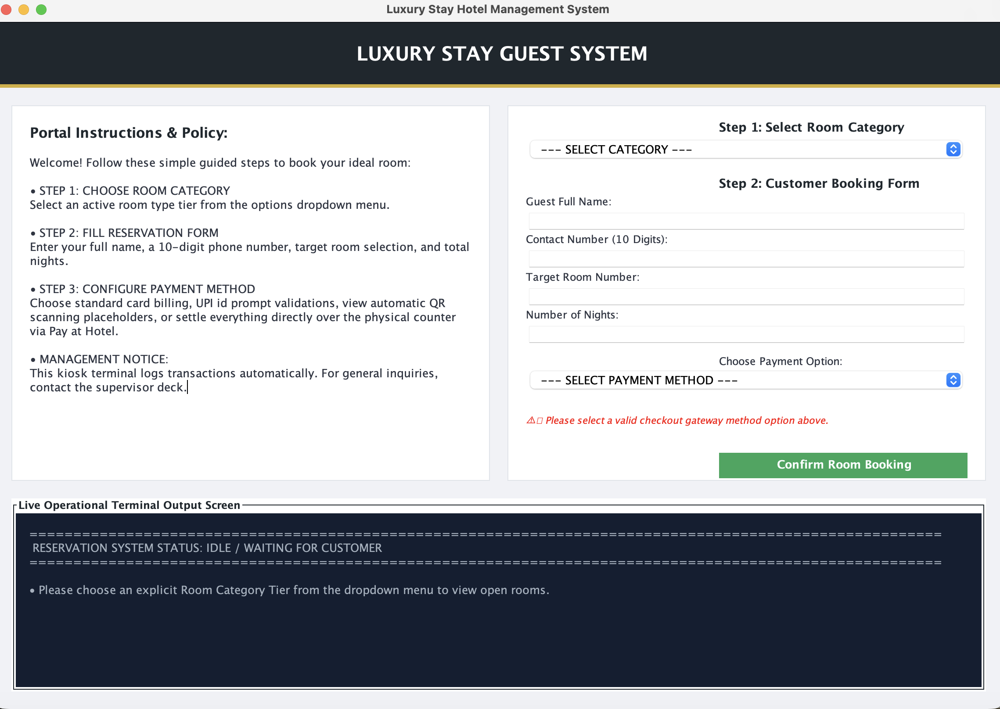

**Project Title** : Luxury Stay Hotel Management System

**Domain** : Java Programming

**Description** : A GUI-based desktop application to check room availability and book reservations.

**Features** : Dynamic payment options, live console terminal monitoring, double-booking protection, and local file storage.

## Project Description
A Java Swing-based desktop application designed to streamline property operations and guest checkouts. It allows users to filter room vacancies in real time and complete bookings through a dynamic form that shifts fields automatically depending on the payment gateway selected.

## Features
* **Interactive GUI:** A clean user interface built with Java Swing and AWT featuring a dual-column layout.
* **Smart Payment Modules:** The app uses a `CardLayout` to dynamically switch input fields based on the selected method:
    * **Card Number:** Collects and validates standard 16-digit sequences.
    * **QR Code Scan:** Instantly auto-generates a dynamic ASCII payment barcode layout inside the output monitor.
    * **UPI ID Prompt:** Formats and accepts virtual payment addresses (e.g., `user@bank`).
    * **Pay at Hotel:** Reserves rooms with zero upfront charges to settle later at the counter.
* **Double-Booking Protection:** Uses thread-safe `synchronized` blocks in the core system logic to guarantee two users cannot book the same room at the same time.
* **Data Persistence:** Automatically streams and saves reservation logs to a local `bookings.txt` file using Java File I/O, ensuring data isn't lost when you close the app.
* **Admin Security View:** Restricts the master transaction history log behind a staff password prompt (`admin123`).
* **Dual Interface Modes:** Includes both the graphical window interface (`MainGUI.java`) and a lightweight, backup text-only terminal runner (`Main.java`).

## Visual Preview


## How to Run
1. Ensure you have the Java Development Kit (JDK) installed.
2. Download all the project files into a single directory.
3. Clean old binaries and compile using terminal:
   ```bash
   rm -f *.class
   javac *.java
4. Run the Graphical UI App Using:
   ```bash
   java MainGUI
